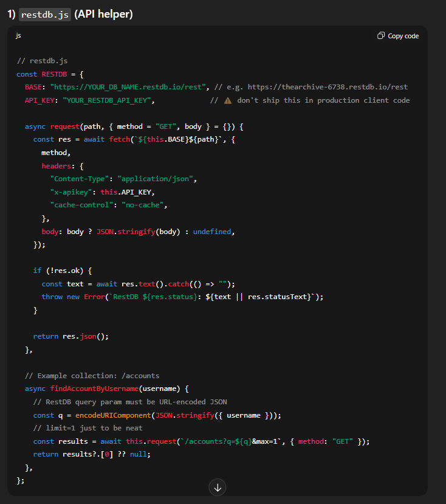
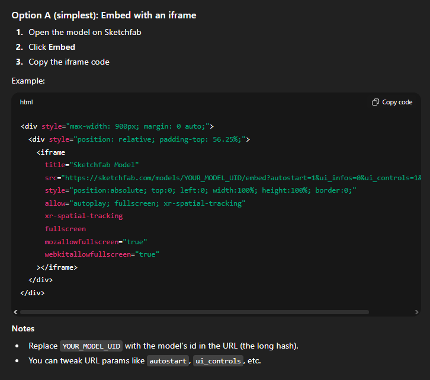
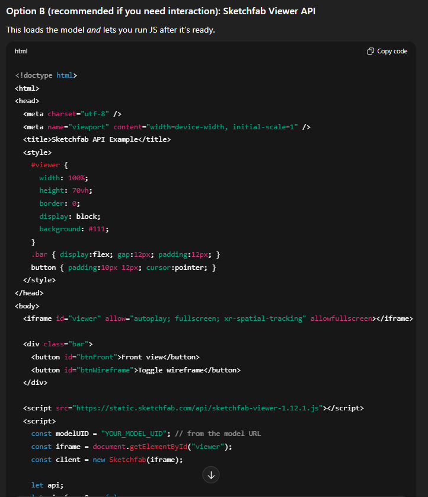

# The Archivist

The Archive is a narrative horror investigation game presented as a secret CAC (Central Archival Committee) terminal experience. Players take the role of a newly hired archivist assigned to investigate unstable artifacts through controlled containment tests. By observing clues, making high-stakes environmental decisions, and surviving each trial, players recover redacted protocol fragments and gradually rebuild the missing archive files. Every choice has consequences, so the gameplay rewards attention, deduction, and composure under pressure.

This project is designed for players who enjoy story-rich mystery games, branching outcomes, and atmospheric tension over pure action. What makes it compelling is the mix of immersive worldbuilding and system-driven progression: each successful test reveals new lore, increases clearance, and unlocks deeper layers of the artifact’s truth. Instead of just “winning levels,” players feel like they are piecing together forbidden knowledge, making The Archive both replayable and memorable.

---

## Links
Github Repo:
Github Deployment: https://pikapokaboo.github.io/IP_Project/

---

## Design Process
The idea for this game was inspired by our collective fascination with the SCP framework and, more specifically, the intrigue of recording and containing objects and events where the origins are completely unknown. We wanted to incorporate this sense of controlled and methodical investigation, where players gradually uncover new levels of truth through observation, investigation, and decision-making. Our goal from the beginning was to build a game that was tense and immersive, with a high level of lore, as opposed to non-stop action.

As a team, we have a collective love of visual novels, and we decided to use this format to present the story through dialogue and world-building. This format allows players to become immersed in each and every artifact investigation and experience the true consequences of their decisions. As a way to keep players interested and to increase replay value, we have incorporated various progression tools, such as achievements and archive clearance. These tools are obvious goals but also offer the player a sense of exploration and completion of every investigation path.

### Target Users
- Players aged roughly 15-30 who enjoy narrative-driven mystery/horror games.
- Students and casual gamers who prefer choice-based gameplay over fast reflex combat.
- Story-focused players who like uncovering lore, hidden details, and branching outcomes.
- Completionist players motivated by progression systems (clearance %, archive completion, full test clears).
- Puzzle/deduction players who enjoy analyzing clues and making strategic decisions under pressure.

### User Goals
- Experience a tense, story-rich mystery with meaningful choices.
- Understand each artifact’s behavior and complete investigations successfully.
- Feel progression through clear milestones (archive completion, clearance, achievements).
- Replay tests to discover different outcomes, dialogue paths, and hidden lore.
- Enjoy an accessible game loop that is easy to start but rewarding to master.

### How This Project Meets Those Goals
- Branching visual-novel choices create direct consequences, making decisions feel meaningful.
- Each test is built around clue reading and deduction (light, sound, power, timing), supporting investigative gameplay.
- Progress systems like protocol fragment unlocks, archive percentages, and achievements give constant feedback and motivation.
- Fail/pass outcomes encourage replay and experimentation, increasing long-term engagement.
- The interface and test structure are straightforward for casual players, while layered conditions provide depth for mastery-focused players.

### User Stories

- As a **new player**, I want to see a clear intro and warning screen, so that I know the game tone and content before starting.
- As a **player**, I want to log in quickly, so that I can access my own progress and continue where I left off.
- As a **story-focused player**, I want to read immersive dialogue and narration, so that I can understand the lore and world of CAC.
- As a **decision-making player**, I want to choose between multiple containment actions, so that my choices meaningfully affect outcomes.
- As a **strategy player**, I want immediate pass/fail feedback after decisions, so that I can learn artifact behavior and improve.
- As a **completionist**, I want to unlock protocol fragments and archive percentages, so that I can track my progress toward full completion.
- As an **achievement-focused player**, I want achievements for key milestones, so that I feel rewarded for mastering all investigations.
- As a **returning player**, I want my progress saved automatically, so that I do not lose completed tests or unlocks.
- As a **casual player**, I want simple navigation between home, archive, and test modes, so that I can play without confusion.
- As a **replay-oriented player**, I want to retry tests after failure, so that I can explore different paths and outcomes.

---

## Features

### Existing Features

- **Terminal-style Login Flow** - allows users to enter the game world immersively, by presenting a CAC-themed startup/login sequence before gameplay.
- **Branching Choice System** - allows users to influence story outcomes, by selecting containment actions during each investigation test.
- **Archive Progression System** - allows users to track achievement and completion, by unlocking protocol fragments and increasing clearance percentages after correct decisions.
- **Pass/Fail Test Outcomes** - allows users to learn from consequences, by triggering immediate success or failure states based on their choices.

### Features Left to Implement
- Add More objects
- Add more gameplay to the visual novel

---

## Technologies Used

- **HTML5** - <https://developer.mozilla.org/en-US/docs/Web/HTML>  
  Used to structure all pages, UI sections, forms, and story containers.

- **CSS3** - <https://developer.mozilla.org/en-US/docs/Web/CSS>  
  Used for styling, layout, animations, and responsive presentation of the terminal/visual novel interface.

- **JavaScript (Vanilla ES6+)** - <https://developer.mozilla.org/en-US/docs/Web/JavaScript>  
  Used to implement game logic, branching story flow, audio handling, UI state, and progression systems.

- **Web Storage API (`localStorage` / `sessionStorage`)** - <https://developer.mozilla.org/en-US/docs/Web/API/Web_Storage_API>  
  Used to store account/session data, test progress, fail counts, and unlocked achievements.

- **Fetch API** - <https://developer.mozilla.org/en-US/docs/Web/API/Fetch_API>  
  Used to load story JSON files and archive text files dynamically, and to communicate with cloud database endpoints.

- **Web Crypto API (SHA-256)** - <https://developer.mozilla.org/en-US/docs/Web/API/Web_Crypto_API>  
  Used to hash user passwords before sending/storing authentication data.

- **RestDB.io** - <https://restdb.io/>  
  Used as the backend database service for account-related data (e.g., login/signup records).

- **LottieFiles Web Player** - <https://github.com/LottieFiles/lottie-player>  
  Used to display the animated loading sequence via JSON-based animation.

- **Sketchfab Embed** - <https://sketchfab.com/developers/viewer>  
  Used to display interactive 3D artifact models inside the archive/object interface.

---

## Assistive AI

Document all AI usage clearly to avoid mark deductions.

### AI Usage Log
| Tool | What it helped with | Output used? | What was changed by me | Evidence |
|---|---|---|---|---|
| ChatGPT | Restdb login API | Partially | I used ChatGPT to give me some code alterations for the RestDB API and to give me a rough template for calling the API from RestDB | `Screenshots/ChatGPT.png` |
| ChatGPT | Sketchfab integration | Partially | I used ChatGPT guide me in implementing the 3D models from sketchfab | `Screenshots/gpt_sketchfab` `Screenshots/gpt_sketchfab_2` |

### AI Screenshots
#### Screenshot 1

#### Screenshot 2

#### Screenshot 3

---

## Testing

### Test Method
Most tests were performed manually because this project is heavily UI/story-flow based (visual novel interactions, branching choices, localStorage progression, and audio/animation timing).

### Manual Test Scenarios

#### 1. Login and Access Control
- Go to `index.html`.
- Enter valid login credentials.
- Verify redirect to `home.html`.
- Enter invalid credentials.
- Verify error/feedback message appears.
- Refresh and verify current user session is retained (if expected).

Result: Pass (manual)

#### 2. Signup Validation
- Go to Sign Up.
- Submit empty fields.
- Verify validation message appears.
- Submit mismatched passwords.
- Verify mismatch message appears.
- Submit valid new account data.
- Verify account creation success message.

Result: Pass (manual)

#### 3. Intro and Warning Flow
- Open `index.html`.
- Verify warning/disclaimer appears.
- Continue intro sequence.
- Verify transition to login screen works without broken visuals/audio.

Result: Pass (manual)

#### 4. Home Navigation
- Login and reach `home.html`.
- Open each main section/tab (Objects, Archive, Achievements, etc.).
- Verify all buttons and modals open/close correctly.
- Verify `Start Testing` opens `game.html` with correct object/test params.

Result: Pass (manual)

#### 5. Visual Novel Story Progression
- Start a test in `game.html`.
- Click/press Enter/Space to advance dialogue.
- Verify choices display when expected.
- Choose different options and verify branching works.
- Verify pass/fail sequence triggers correctly and returns to home when expected.

Result: Pass (manual)

#### 6. Progress Persistence
- Complete/fail a test.
- Return to home/archive.
- Verify progress values, fail counters, and archive completion update correctly.
- Refresh page and verify progress persists via localStorage.

Result: Pass (manual)

#### 7. Achievement Unlocks
- Trigger known achievement conditions.
- Verify achievement state updates in UI.
- Reload page and verify unlock remains saved.

Result: Pass (manual)

#### 8. Object/Archive Unlock Conditions
- Progress Object 1 until Object 2 should unlock.
- Verify Object 2 visibility/availability updates correctly.
- Verify locked content is hidden before unlock conditions are met.

Result: Pass (manual)

#### 9. Audio and Controls
- Verify BGM/SFX plays at expected events.
- Test volume slider and confirm changes apply.
- Verify autoplay/skip/restart buttons work in VN mode.

Result: Pass (manual)

### User Story Testing

- **User Story:** As a new player, I want to see a clear intro and warning screen, so that I know the game tone and content before starting.  
  **Test:** Opened `index.html`, verified warning screen appears first, then advanced through intro sequence to login screen.  
  **Result:** Pass.

- **User Story:** As a player, I want to log in quickly, so that I can access my own progress and continue where I left off.  
  **Test:** Logged in with valid credentials and verified redirect to `home.html`; attempted invalid credentials and verified feedback modal appears.  
  **Result:** Pass.

- **User Story:** As a decision-making player, I want to choose between multiple containment actions, so that my choices meaningfully affect outcomes.  
  **Test:** Started a test in `game.html`, selected different choice branches, and verified different labels/outcomes were triggered.  
  **Result:** Pass.

- **User Story:** As a strategy player, I want immediate pass/fail feedback after decisions, so that I can learn artifact behavior and improve.  
  **Test:** Triggered both correct and incorrect choices in object tests and verified pass/fail call sequences with system feedback and return flow.  
  **Result:** Pass.

- **User Story:** As a completionist, I want to unlock protocol fragments and archive percentages, so that I can track my progress toward full completion.  
  **Test:** Completed tests and checked archive tab updates (`Completion: x%`) and corresponding file content changes.  
  **Result:** Pass.

- **User Story:** As a returning player, I want my progress saved automatically, so that I do not lose completed tests or unlocks.  
  **Test:** Completed a test, refreshed/reopened the app, and verified test progress, archive completion, and achievements remained saved via local storage.  
  **Result:** Pass.

### Browser and Screen Size Testing
Tested on:
- Chrome (Windows): Pass
- Edge (Windows): Pass
- Firefox (Windows): Minor UI spacing differences in some modal/card areas, core gameplay unaffected
- Safari: Not tested yet
- Mobile (Android/iOS): Limited testing; layout is usable but desktop provides best experience for full UI readability

Screen sizes:
- 1920x1080 desktop
- 1366x768 laptop
- 768x1024 tablet
- 390x844 mobile

Responsive notes:
- Main navigation and story panels remain functional across tested sizes.
- On smaller screens, long text blocks and modal content require more scrolling.
- The game is best experienced on desktop/laptop due to dense narrative UI and multi-panel terminal layout.

### Bugs Found / Known Issues
- Bug: Story JSON/image path casing mismatch risk
  - Steps to reproduce: Run the project on a case-sensitive environment and load a story with mixed-case asset names.
  - Expected: All assets load consistently.
  - Actual: Some assets may fail to load if filename case differs from JSON references.
  - Status: Open (works on Windows, may break in strict case-sensitive deployments).

- Bug: Intro/login timing can feel long for repeat sessions
  - Steps to reproduce: Open `index.html` without skip parameter and wait through full intro sequence.
  - Expected: Fast path for returning users.
  - Actual: Intro animation sequence may delay reaching login/game flow.
  - Status: Partially mitigated (`skipIntro`/`skipHomeIntro`), further UX tuning planned.

- Bug: Mobile layout readability at small widths
  - Steps to reproduce: Open on narrow screens (around 390px width), view terminal cards and long archive text.
  - Expected: Comfortable reading without excessive scrolling.
  - Actual: Dense UI sections require frequent scrolling and tighter reading space.
  - Status: Open (functional but not yet fully optimized for mobile-first play).

---

## Individual Contribution
Reyner: game.html, home.html, index.html, style.css
Xing Yi: obj1-test1.json, helped with home.html

---

## Credits

### Audio
- Footsteps: https://pixabay.com/users/freesound_community-46691455/
- Sliding Door: https://pixabay.com/sound-effects/film-special-effects-sliding-noise-v2-83483/
- Login Music: https://www.youtube.com/watch?v=YJaeH8ffl_M
- Warning and Logo sounds: https://www.youtube.com/watch?v=WglZpEeyMso
- Loading Audio: https://www.youtube.com/watch?v=qUdDz1PUUls
- Boot Up Sound: https://www.youtube.com/watch?v=7FiFBKINg1k
- Home Screen Music: https://www.youtube.com/watch?v=5oF5lS0sajs&list=PLfP6i5T0-DkI74kb_BWxYNZRjIvF1D4Lp
- Button Click Audio: https://www.youtube.com/watch?v=KFNhJnp7eQ0
- Achievement Audio: https://www.youtube.com/watch?v=tgo30hh86Wg
- Visual Novel Audio: https://music.youtube.com/watch?v=AKjxL_aMf1Q
- Blip: Sound Effect by Driken Stan from Pixabay

### Icons
- Patreon Icon: https://www.clipartmax.com/middle/m2H7m2i8i8m2N4G6_transparent-patreon-logo-patreon-png/
- Ko-fi Icon: https://uxwing.com/ko-fi-icon/
- Itch.io Icon: https://icon-icons.com/icon/itch/146025

### Artworks
- Login Page Artwork: https://www.pinterest.com/pin/68046644341682061/

### Lottie Animation
- Loading Animation: https://lottiefiles.com/free-animation/hidden-folder-D5J1s78Way

### Acknowledgements
- Inspired by the SCP Foundation, SCP Secret Files
